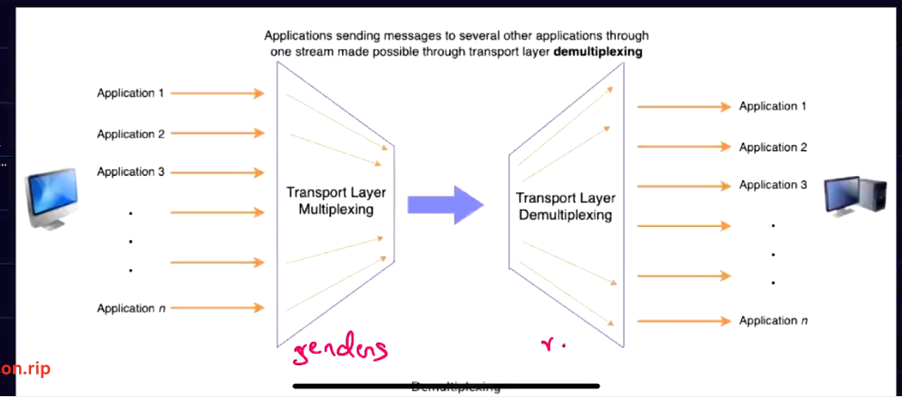

# Transport Layer

- It is the most important layer in the network stack
- Plays a very important role in establishing a connection b/w the application layer and network layer.

- 
- Transport layer resides on the end system

## Responsibility of the Transport Layer

- **Segments Data**
  - Network layer is not able to directly understand what session/application layer sends.
  - So, transport layer divides the data into manageable peices called `segments`(in case of tcp) or `DataGrams`(in case of UDP)
  - Add headers to the packets

- **Allowing Multiple Conversations**
  - Tracks each application to application connection or conversation seperately
  - Which can allow multiple conversations to occur at once.

- **Multiplex the data**
  - Multiplexing is the process of gathering the data from multiple application processes of the sender, enveloping that data with headers and sending them as a whole to the intended receiver.
  - It allows messages to be sent to more than one destination host via single medium
  - (Just a tukka) ==> can be understood as multiple apps ka data sent/receive ki request ko ek packet mei band kr dena taaki usse mai router mei pahuncha sakun
  - Can be done using 
    - Frequency based like providing diff freq for radio and tv brodcast
    - Time sharing 
    - CDMA

- **Demultiplexing Data**
  - deleivering the received segments at the revceivers side to the connect app layer process is called as demulitplexing.

- **Reliable data transfer**
  - through TCP
  - There are a lot of network layer imperfections that the transport later is supposed to deal with.
  - Like
    - Segments can be corrupted.
    - Segments can be lost
    - Segments reordered/duplicated.