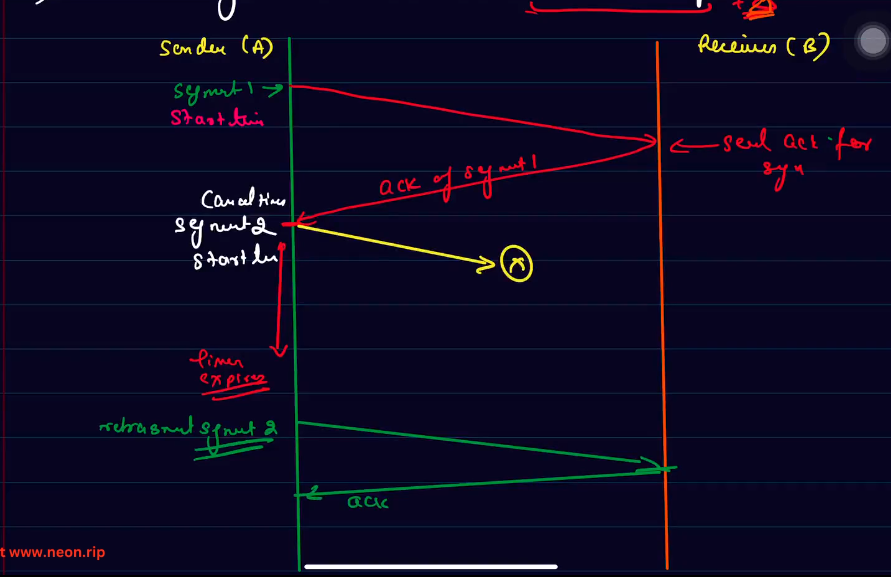
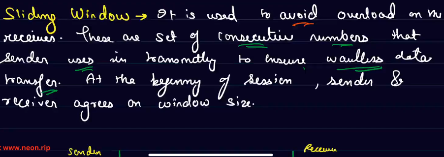
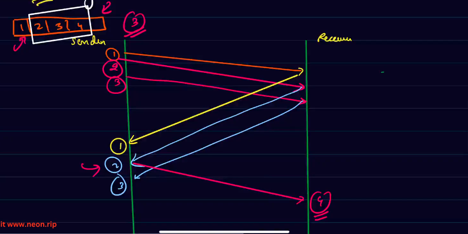

# Realiable Data transfer

1) **Checksum**
   1) To check if a segement got corrupted or not
   2) WIll sum them up,
   3) If not equal to checksum provided in the header,then surely corrupted
2) **retransmission Timers**
   1) These are timers that are exectuted when we are sending a packet and gets timed out after round-trip value plus some delta.
   2) `Round-trip timer` total time taken from sending a packet to receiving its acknowledgement across one trip.
   3) If the timer times out
      1) There must be some issue
      2) The packet is not sent
      3) So we can resend the data.
   4) 
   5) **Limitation**
       1) What is the data is getting transmitted, but transmission of the acknowledgemnt fails. In this case, same packet is going to be transmitted again and again.
3) **sequence Numbers**
    1) Identification numbers attached to each segment to identify duplicacy as well as re-orderin.

## Concept of Sliding Window

- Since now, the sender is able to send only one package at a time and has to wait for its acknowledgement.
- Therefore, it now wants that it will send many packages simuntaneously and later get their acknowledgement at once.
- 
- What will happen is:
  - Suppose sliding window size is 3.
  - package 1 send
  - package 2 send
  - package 3 send
  - As soon as i get the ack of packet 1
    - Sliding windows shifts
    - package 4 is sent.
- 
- Suppose if ack of 1 and 3 is received but not of 2,
  - then `Go-back` and `selective-repeat` protocol comes into the picture.
