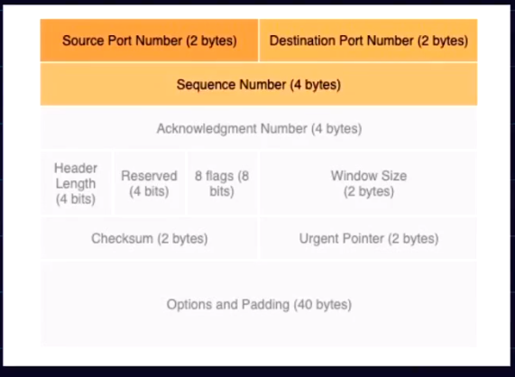
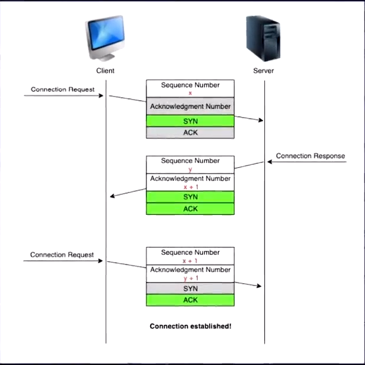

# TCP

Transfer control Protocol

- Happens in transport layer

## What TCP does

- **Identify and re-transmit the message**

- **Send data**
  - At an approcpriate transmission rate
  - That is not too fast to cause congestion and not too slow too.
- **Segments the data**
  - application Layer sends a continuous stream of unsegmented data which it receives from the user.
  - This is divided into appropriately sized segments
  - Segment is a collection of bytes
  - Suppose that the segement is also very big
    - Therefore, network layer will now re-divide it into smaller packtes and these will be sent to the reciever.
    - Now, the transport layer of the receiver will re-assemble them in order to pass them to the  application layer of the receiver.
- **Congestion Control**

## Applications of TCP

- FTP
  - File Transfer Protocol
  - Suppose a big file is getting sent
  - We never wants that the bits gett missing or re-ordered.
- SSH
  - Secure Shell Host
  - Allows a secure connection to a remote host
  - Used majorly to execute some OS shell commands on a remote server
- Email
- Web-browsing
  - HTTP/Https both are done over the TCP.

## Key Features

- Connection Oriented
  - Connection remains until a certain termination is followed
- Fully duplex
  - Both the parties on the TCP connection can send and recieve simunateously.
- Point to point transmission
  - exactly have 2 end points
  - that is broadcasting and multicasting is not possible with TCP
- Error Control
  - Detects erros in the packets.
- Congestion Control

## Segment Header

- **FLAGS**
  - CWR
    - Congestion Window Reduce
      - When the sender starts to reduce the congestion rate due to ECN.
  - ECN
    - Explicit Congestion Notification
    - When congestion happens at receiver.
      - Asks to reduce the speed of data sending
  - URG
    - Urgent flag
    - Suppose uploading a large file
      - Sender realises it is a wrong file
      - So sends a command to stop the transfer.
      - Now, initally it should go to the end that if after the transfer before the urgent flag
      - But now as it is marked urgent therefore, it will be immediately processed. 
  - ACK
    - Acknowledge segment
  - PSH
    - PUSH flag
    - Efficeincy of the TCP connection increases.
    - Immediately push all the packets recieved till now to the application layer without waiting for the rest of them at the recievers end.
    - Majorly used in TELnet.
      - Where each key stroke is a command 
      - It doent make any sense to wait for each key stroke and then send them
  - RST
    - Reset flag
    - Immediately Terminates a connection
  - SYN
    - Syncronisation flag
    - Establishes a TCP connection
  - FIN
    - Finish Flag

- Checksum
  - Error Detection

## The 3 way hanshake

1) Client sends a connection request to the host
   1) With a random sequence number.
   2) SYN flag = set
2) Reciever sends a connection respond
3) Again connection request is sent.
   1) With syn = false
   2) ACK = set.
