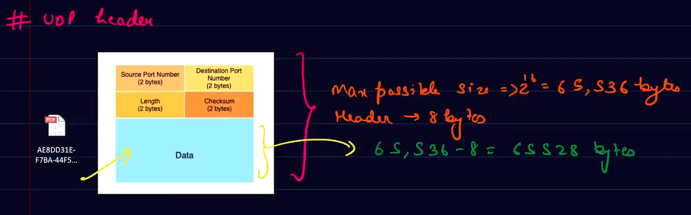

# UDP

- User datagram protocol
- used by applications that dont needs guranteed delievery either because app handles it itself or just don't need it.
- Much simpler than TCP
- It gets the data
  - COnverts it into UDP `datagram`
  - Send it to network layer.

## UDP header

## WHY UDP

- faster
- Realiability can be built sepratley
- Small header size gives an edges in term of reduced transmission overhead & quicker transmission times.

## Applications

- X-box
- Name translation of DNS.
