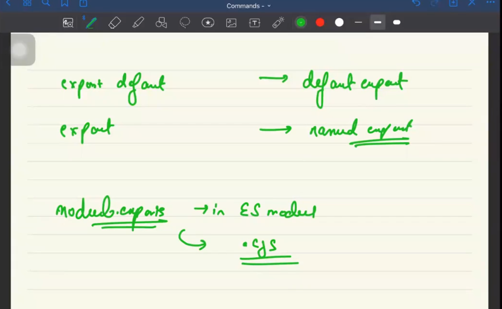

# Introduction to NOde

- **libraries** are intended to doa very simple task.
- **FRamework** is like a collection of libraries;
- ruby on rails is a framework.
- Node is neither a framework nor a language.
- Node is a runtime through which
  - we can run js on our terminal, and features like
    - event queue
    - microtask queue are available to us
  - allows js to use OS functionalities like
    - file system
    - process management
    - streams
  - but do not have the js part responsible for the dom manipulation
- Js is still syncronous inside the node too.
- timers inside node used os timers while timers of js uses browsers timers
-  

## Module Pattern

-

## How to execute js code

- inside terminal write:
  - `node file_name.js`
- 

Module patterns in Node.js are essential for organizing code, encapsulating functionality, and promoting code reuse. There are several module patterns commonly used in Node.js, including CommonJS, ES6 modules, and the revealing module pattern. Below is a documentation outlining these patterns:

---

## Module Patterns in Node.js

### 1. CommonJS

CommonJS is the module format initially specified for Node.js. It relies on `require()` to import modules and `module.exports` (or `exports`) to export functionalities.

#### Example:

**`math.js`:**

```javascript
// math.js
function add(a, b) {
    return a + b;
}

function subtract(a, b) {
    return a - b;
}

module.exports = {
    add,
    subtract
};
```

**`app.js`:**

```javascript
// app.js
const math = require('./math');

console.log(math.add(2, 3)); // Output: 5
console.log(math.subtract(5, 2)); // Output: 3
```

### 2. ES6 Modules

With the increasing adoption of ECMAScript 6 (ES6), Node.js added support for ES6 module syntax, allowing developers to use `import` and `export` statements.

#### Example:

**`math.js`:**

```javascript
// math.js
export function add(a, b) {
    return a + b;
}

export function subtract(a, b) {
    return a - b;
}
```

**`app.js`:**

```javascript
// app.js
import { add, subtract } from './math';

console.log(add(2, 3)); // Output: 5
console.log(subtract(5, 2)); // Output: 3
```

### 3. Revealing Module Pattern

The Revealing Module Pattern is a design pattern that encapsulates private data and exposes only the necessary functions and variables, typically by returning an object literal containing the methods.

#### Example:

```javascript
// math.js
const mathModule = (function() {
    // Private variable
    let privateVariable = 'This is private';

    // Private function
    function privateFunction() {
        return 'This function is private';
    }

    // Public functions
    function add(a, b) {
        return a + b;
    }

    function subtract(a, b) {
        return a - b;
    }

    // Revealing public pointers
    return {
        add,
        subtract
    };
})();

module.exports = mathModule;
```

**`app.js`:**

```javascript
// app.js
const math = require('./math');

console.log(math.add(2, 3)); // Output: 5
console.log(math.subtract(5, 2)); // Output: 3
```

---

These patterns offer different approaches to structuring and organizing code in Node.js applications. Developers can choose the pattern that best suits their project's requirements and coding style.


## more stuff

- suppose, my `type:module` then to use commonjs insde the same , i have to rename the commonjs files as `.cjs`.
- vice-versa will be applicable for the type:commonjs and using es6 syntax.

## ES6 way

- `export default variable/func` tells what will be retuned by the module as a default behaviour.
- can only be used once
  - Can be imported by any name 
  - Syntax
    - `import abc from "./file_name.js"`
- `export const abc= someyhing something`
  - name should be same
  - any number of ityems can vbe xported
    - syntax
      - `import {variable_name} from "./file_name.js"`

- 

- 