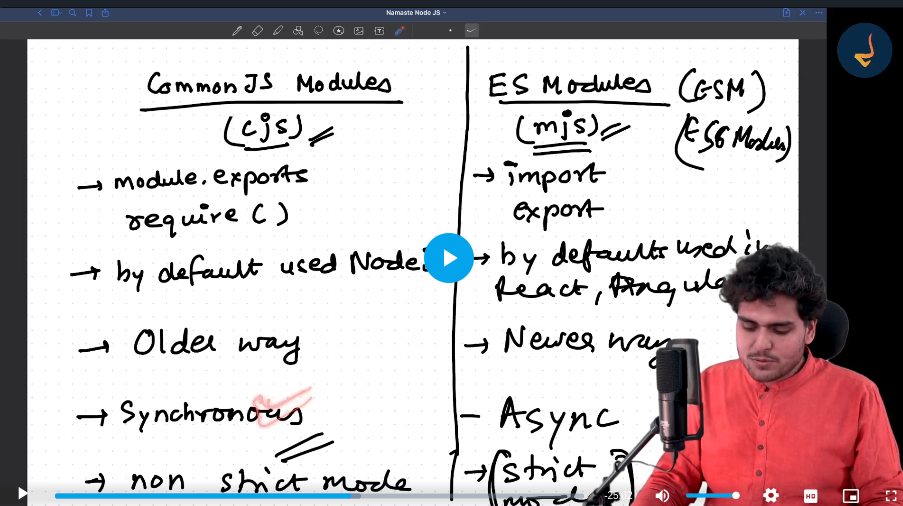

- [Commonjs](./commonjs/Readme.md)
- [EJS](./EJS/Readme.md)
- [Diff](../../../../../../AppData/Local/Packages/Microsoft.YourPhone_8wekyb3d8bbwe/TempState/medias/20240910_212945.heic)
- [Importing Json Data](./ImportingJson.md)
- Modules are provided to us by nodejs
# Comparison of CommonJS (CJS) and ES6 Modules (MJS)

| Feature                       | CommonJS (CJS)                                      | ES6 Modules (MJS)                              |
|-------------------------------|-----------------------------------------------------|------------------------------------------------|
| **File Extension**            | `.js` (default for Node.js)                        | `.mjs` or `.js` (when `"type": "module"` is set in `package.json`) |
| **Syntax for Exporting**      | `module.exports = ...`                             | `export ...`                                   |
| **Syntax for Importing**      | `const module = require('module');`                | `import { ... } from 'module';`                |
| **Default Export**            | `module.exports = ...`                             | `export default ...`                           |
| **Named Exports**             | `module.exports = { foo, bar };`                    | `export { foo, bar };`                         |
| **Importing Default Export**  | `const foo = require('module').default;`           | `import foo from 'module';`                    |
| **Importing Named Exports**   | `const { foo, bar } = require('module');`           | `import { foo, bar } from 'module';`           |
| **Dynamic Imports**           | `require()` is synchronous, cannot be used for dynamic imports. | `import()` is asynchronous and supports dynamic imports. |
| **Module Resolution**         | Relies on Node.js module resolution algorithm       | More strict and consistent across different environments. |
| **Compatibility**             | Node.js specific, not natively supported in browsers. | Standardized, supported in modern browsers and Node.js. |
| **Circular Dependencies**     | Can handle circular dependencies.                  | Can handle circular dependencies but may have different behavior. |
| **Top-Level `await`**         | Not supported.                                     | Supported (Node.js 14.8.0+ and ES2022+).       |
| **`this` Context**            | `this` refers to the module object.                 | `this` is not available in modules.            |


**Strict mode** means we have to explicitly define weather a variable is `let or const or var`


# Grouping Files
 When you're working with multiple files in a Node.js project, you might want to group related functions or modules together to keep your code organized and maintainable. Here’s how you can do that by creating and using modules.

### Example Structure

Assume you have a project directory with the following structure:

```
project/
│
├── src/
│   ├── math/
│   │   ├── add.js
│   │   ├── subtract.js
│   │   └── index.js
│   │
│   ├── utils/
│   │   ├── format.js
│   │   └── index.js
│   │
│   └── main.js
│
└── package.json
```

### 1. **Define Functions in Separate Files**

Let's start by defining some functions in separate files:

#### `src/math/add.js`
```javascript
function add(a, b) {
    return a + b;
}

module.exports = add;
```

#### `src/math/subtract.js`
```javascript
function subtract(a, b) {
    return a - b;
}

module.exports = subtract;
```

#### `src/utils/format.js`
```javascript
function formatNumber(num) {
    return num.toFixed(2);
}

module.exports = formatNumber;
```

### 2. **Group Functions in Index Files**

Next, create `index.js` files to group related functions and export them together:

#### `src/math/index.js`
```javascript
const add = require('./add');
const subtract = require('./subtract');

module.exports = {
    add,
    subtract
};
```

#### `src/utils/index.js`
```javascript
const formatNumber = require('./format');

module.exports = {
    formatNumber
};
```

### 3. **Import Grouped Modules in Main File**

Finally, use these grouped modules in your `main.js`:

#### `src/main.js`
```javascript
const { add, subtract } = require('./math');
const { formatNumber } = require('./utils');

// Example usage
const result1 = add(5, 3);
const result2 = subtract(10, 4);

console.log(`Addition result: ${formatNumber(result1)}`);
console.log(`Subtraction result: ${formatNumber(result2)}`);
```

### Summary

1. **Define Functions**: Place each function in its own file for modularity.
2. **Group Functions**: Use `index.js` files to group related functions together.
3. **Import and Use**: Import grouped functions from the `index.js` files in your main code.

This approach keeps your code organized, makes it easier to manage, and helps in maintaining a clean project structure.