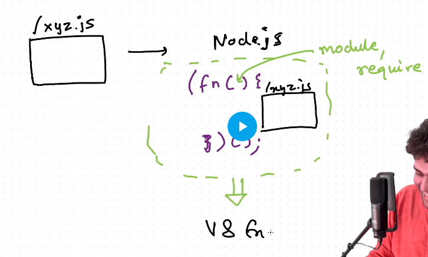

Wehenever we create a module in js, basically what happens in the backend is that the nodejs will enclose all the things which we want to export into another function and export them.

on `require("./xyz.js")` nodejs will get the code from xyz and wraps it inside a `fucntion(IIFE)`

## IIFE in js

```js
(function(){

})() //Created and called the function at the same time
```

- Immediately Invoked Function Expression
- Keeps your variable and functions safe.

## IIFE in Nodejs
```js
(function(module, require){
    function abcd(){

    }
    module.exports = {abcd};
})(module.exports = {}) //Created and called the function at the same time
```
- nodejs passes module as a parameter to the IIFE
- 

## 5 steps mechanism of require

1) Resolving a module
   -  weather its a 
      -  json
      -  custom code file
      -  module from node
2) Loading the module
   - file content is loaded according to the file type
3) Wraps inside an IIFE
4) Evaluation
   - this is where the module.exports happen
5) Caching
   - suppose same module is required in various files, then to prevent it from again and again doing the hardwork of creating the IIFE, caching is done