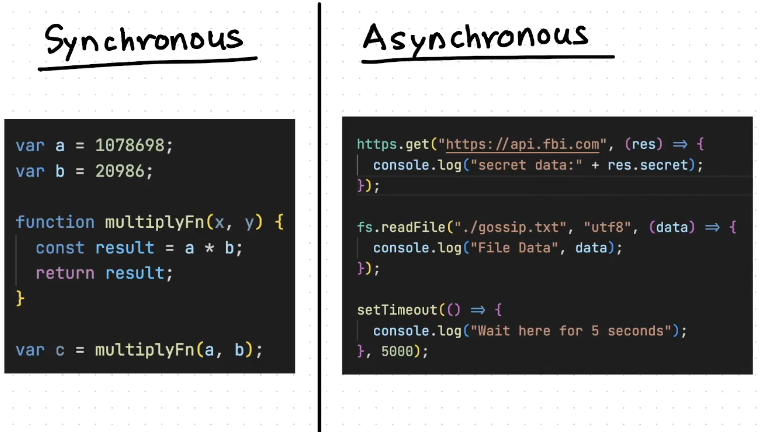
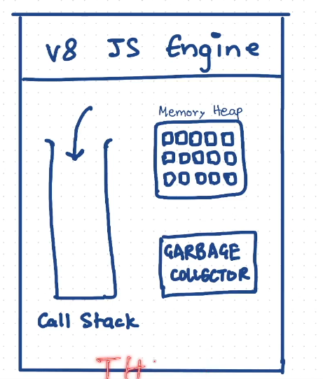
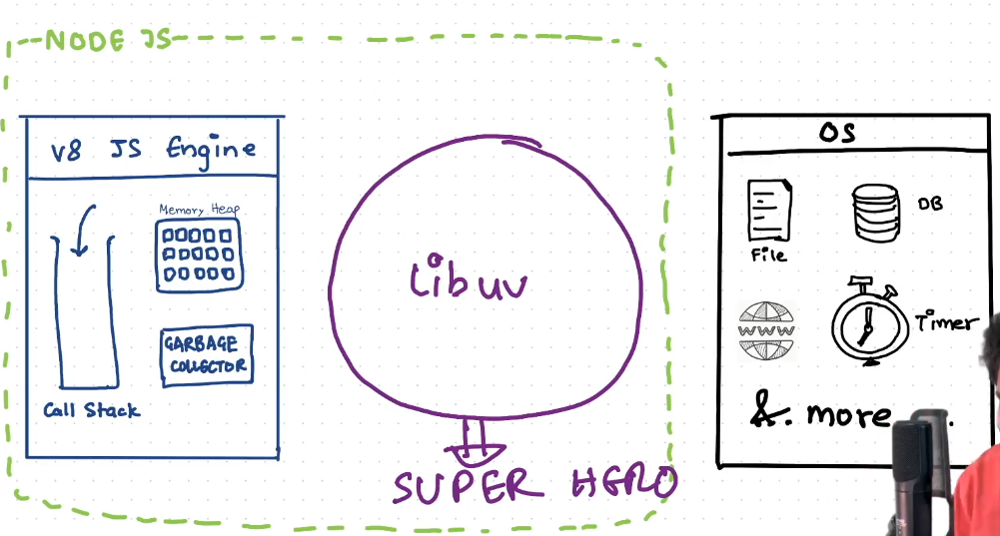
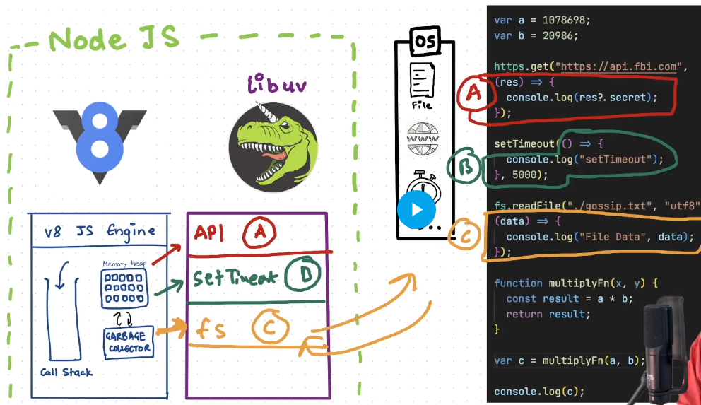

# Libuv and Async.io

- Nodejs has a event-driven architecture
- Capable of async input outputs
- js is a single threaded sync language 
  - Like one single waitor in a restaurant
  - libuv(from node.js) acts as the back kitchen to fulfills the order of the customers
- tasks are divided like :
  - takes time  : process it as async
  - doesnt take time  : process it as async
  - 
- Structure of js engine
  - 
- 
  - connects the js with OS.
  - v8 offloads async task to libuv
  - Async IO made simple
- Libuv has a  
  - Eventloop
  - Threadpool
  - io queue
  - timers queue
  - and more....
- 