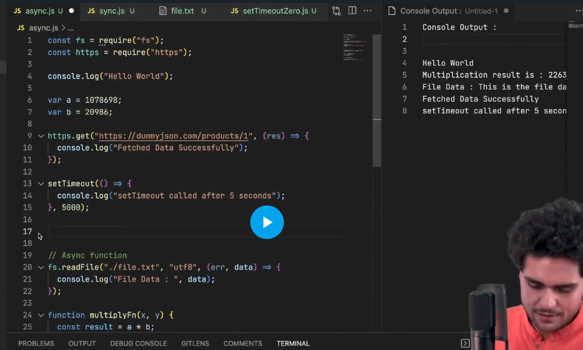

- set time out works when the time completes and the event loop is empty
- therefore  a set timeout with 0ms delay, wont be executed on the go.
- it will execute when the global execution context gets completelty executed