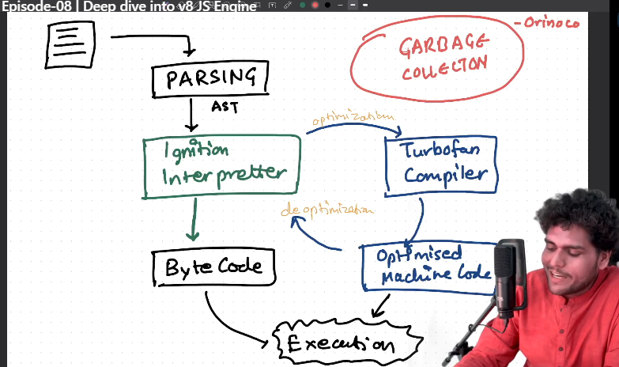

# Deep dive into v8 Engine

## what happens when a code is passed to V8
- Code parsing is done
- Lexical analysis : 
  - Conversion of code into small tokens
- Syntax Analysis
  - Tokens are converted into AST( Abstract Syntax Tree)
  - Sytax Parsing/parsing 
  - 
  - 
  - deoptimization happens in case when suppose we have a add function which takes two vars a, b and returns a+b; now , this function generally takes number, so the turbofan compiler will optimize the function for numbers , but if i will now pass two strings to the same function, now it has to re-compile the same function for strings, so now it will deoptimize the code