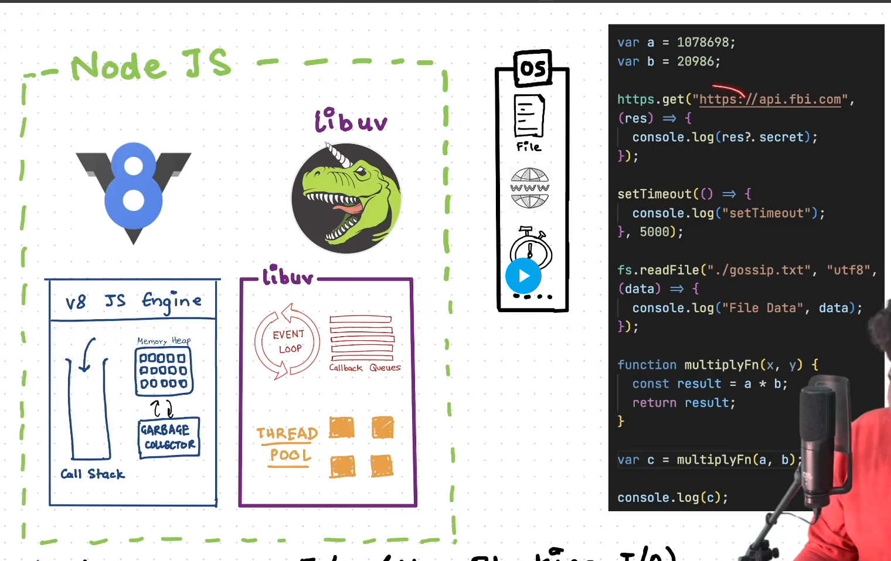
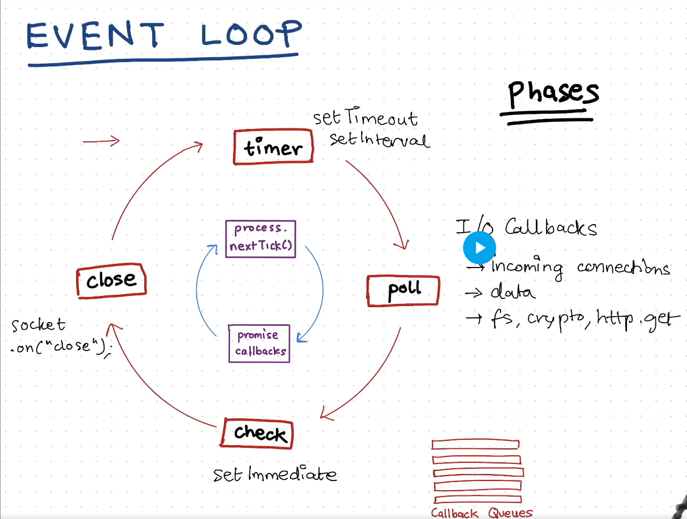
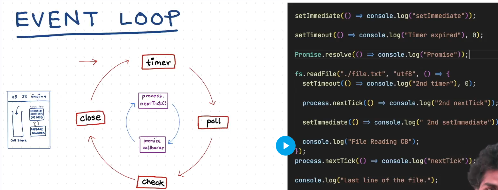

# libuv and the event loop

- The async tasks are offloaded to libuv
- async i/o (non-blocking io) can only be done in nodejs only due to libuv
- 
- inside the v8 engine async tasks are offloaded to libuv, and main thread moves to the next lines of the code.
  - it will now set idle 
  - Now, internally libuv do the tasks
    - Reading the file or `making an API call` via making a call to the OS
      - Once complete then will call the callback function inside the main call stack
    - Similarly, for the set time out
      - libuv will offload the task to the main call stack as soon as the timer expires and main thread gets empty.
- Basically, libuv takes a tasks 
  - completes it (**Done by thread pool**)
  - keep the call back for the same function inside the callback queue of the libuv
  - **Event loop fucntion** now, as soon as the main callback stack gets empty, it empties the callback queue to the stack

### Event loop Prioritization :
- Suppose many job completes at the same time, now how event loop handles them:
  - 
  - Before every step, the inside blue cycle is ran.
  - Like this is the flow
    - process.nextTick()
    - promise callback
    - `timer`
    - process.nextTick()
    - promise callback
    - `poll`
    - process.nextTick()
    - promise callback
    - `check`
    - process.nextTick()
    - promise callback
    - `close`
    - *Back to top.........* 
- If all the four phases are empty,
  - Event loop will wait at the poll phase
- Event loop of node js is a lot different than event loop inside the browsers.

- Output
  - Last line
  - next
  - Promise
  - Timer expired
  - SetImmediate
  - `Event Loop was stuck in the poll phase`
  - File reading CB
  - 2nd next tick
  - 2nd setImmediate
  - 2nd timer
