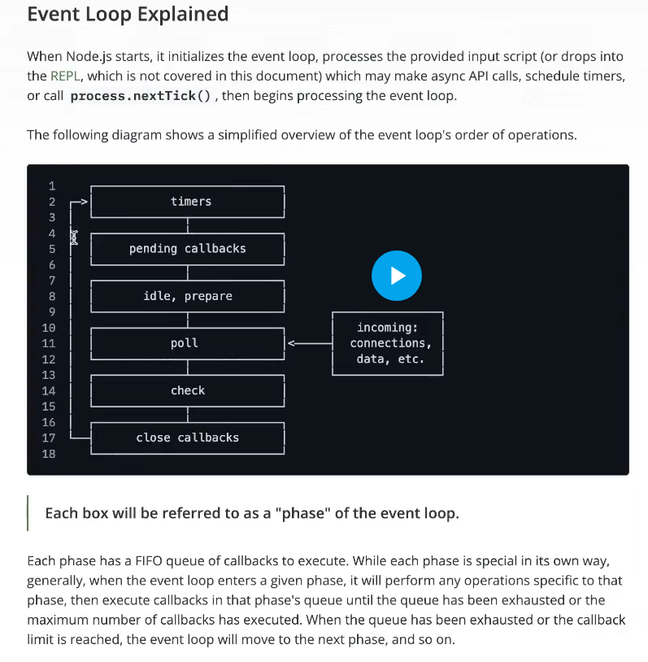
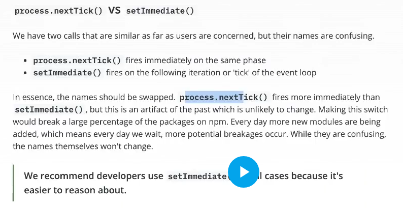

- There is a `pending callback` state b/w timer and poll, which contains all the callbacks which got delayed
  - the reason might include `starvation`
- One full cycle of event loop is called an `tick`.
- idle and prepare phases are handled internally.
- **How Libuv knows how much time it can stay idle?**
  - Basically, suppose we have 2 timers. One for 4 secs, and another for 10 secs. Now , libuv knows it will take minimum of 6 secs to get a call for the callback of 10 sec timeout. Therefore , i can be idle for the next 6 secs.
-  
## Thread Pool
- handles async works
- libuv offloads the task to the thread pool, where one task comes, gets a thread , and starts to works
- default number of threads in the thread pool is 4
-  fs, dns.lookup, crypto, userbased input are generally sent to nodejs
-  

```
For sync code ==> nodejs is single threaded
for libuv ==> it becomes multi-threaded. 
```

```app.js
process.env.UV_THREADPOOL_SIZE = 2

// will change the thread pool size 
```

### Threads and Multiple parallel calls to the server

- Sockets are needed for any incoming request
  - Each socket has a `socket Descriptor`
  - **API call to write data on server**
    - like post, put , patch
      - Since , wanna write , so cant do anything else 
        - Threfore, thread is created for the same
        - **Implies ==>** 1000 API calls ==> 1000 threads . 
        - ❌❌ ==> nooo
    - **Existence of Epoll**
      - It is a scalable event notification mechaninsm of linux
      - It is a not a `thread per connection model`
      - Instead of creating multiple socket descriptor for multiple connections , we create one `Epoll Descriptor`. 
        - This epoll descriptor will manage multiple connections.
      - So,  now what happens
        - Epoll manages multiple connection
          - If it empty , then just ignore 
          - else : 
            - for any work on a connection 
              - Inform the libuv of it via `Event Emitters`
              - `Now , thats the reason it is called an event driven architcture.`

## Fun Fact :
-   the `timer queue` doesnt use queue internally, 
    -   it uses a min heap
    -   Similarly
        -   Epoll uses Red-Black trees. 
-   `Process.NextTick` happens immediately
    -   while, `setImmediate` happens in at the almost end of an tick.
    -   