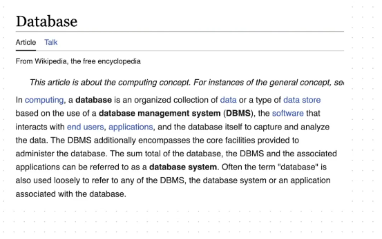
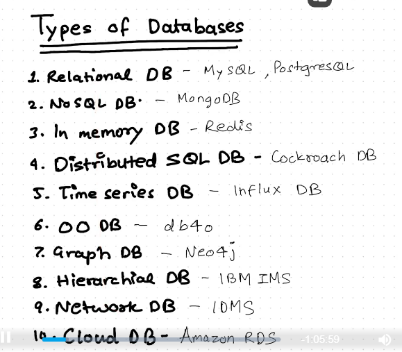
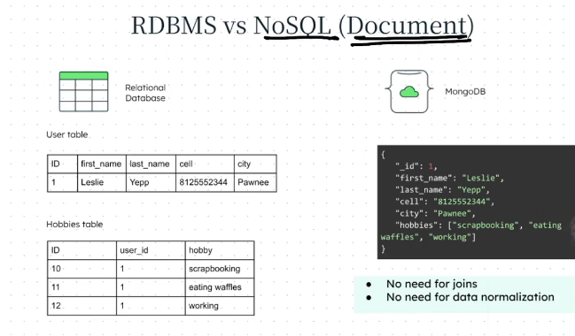
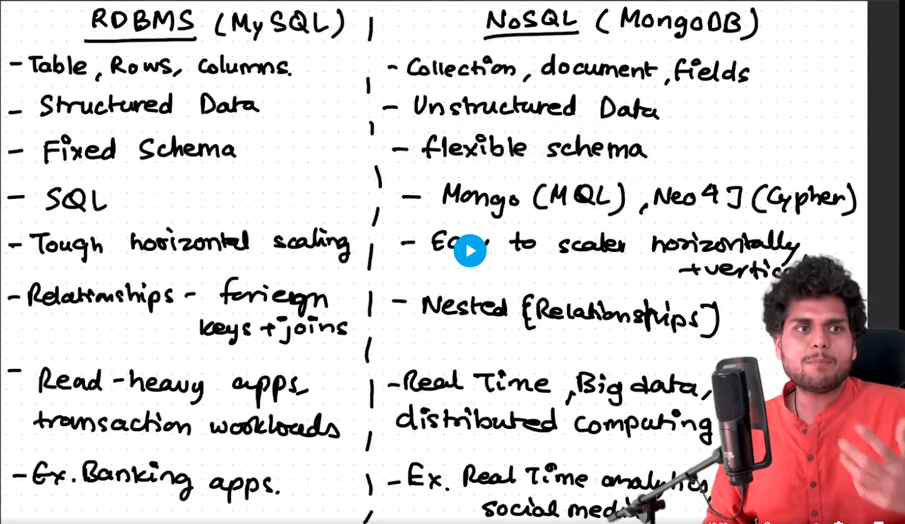

# Databases

- 
- 
  - Some data base is related to one another, like graphDb is a NoSQL db.
- No SQL Db ==> Fan calls `Not Only SQL`, Hater's call `Not SQL`
  - DocumentDB
  - KeyValue DB
  - GarphDB
  - WideColumnDB
  - MultimodelDb
- MongoDb goes really well, hand in hand with the Nodejs. Like works well for json.

## RDBMS vs NoSQL (Document)

- 
- 