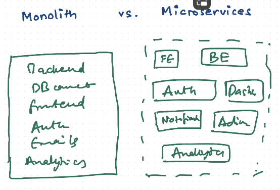

## Waterfall Model 

1. Requirements
   1. Collected by PM(Project Manager) Or CEO (in case of startup)
   2. Works with designers to create the UI Mocks
2. Design  
   1. Senior Engineers/EM makes the design documents
      1. These Documents tells us about the Architecture of the Application
3. Development
   1. SDE1, SDE2
4. Testing
   1. SDET
   2. writing unit test cases is the job of developers 
5. Deployment
   1. DevOps / Developers
6. Maintenance
7. `Back to 1.`

## Monolith vs MicroServices

### Monolith

- All the code in **a single, unified codebase or application**.

### Microservices
- Multiple small services/project/application for every task.
  - Each service is dediacated to one job only 

### Difference

- Development Speed : 
  - 