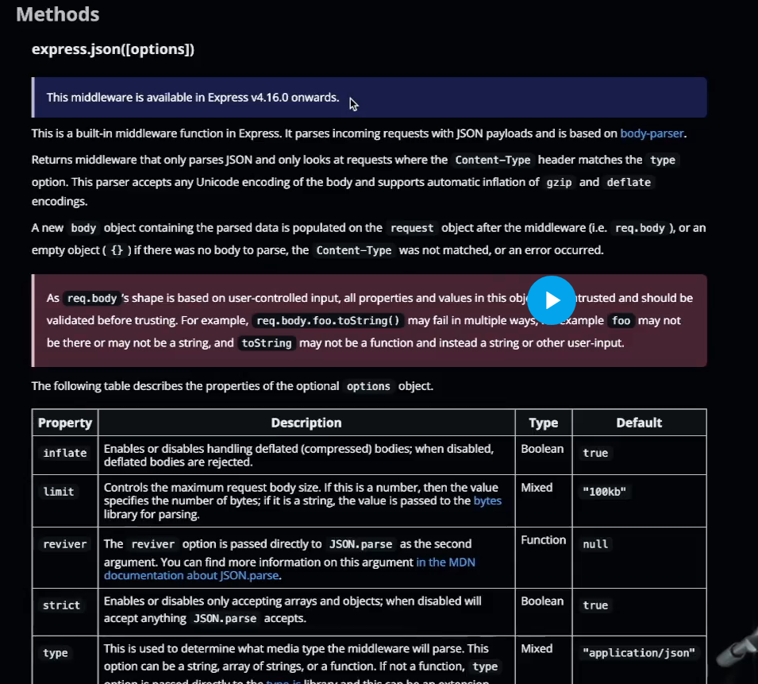

## JSON vs. JavaScript Object

1. **Definition**:
   - **JSON**: A text-based data format used for transmitting and storing data (language-independent).
   - **JavaScript Object**: An in-memory data structure in JavaScript with key-value pairs.

2. **Format**:
   - **JSON**: Strict syntax; keys must be in double quotes, no functions or comments.
   - **JavaScript Object**: Can include functions, methods, and other data types.

3. **Usage**:
   - **JSON**: Primarily for data exchange (e.g., in web APIs).
   - **JavaScript Object**: Used to represent and manipulate data in JavaScript code.

4. **Conversion**:
   - **JSON → JavaScript Object**: `JSON.parse()`
   - **JavaScript Object → JSON**: `JSON.stringify()`

5. **Example**:
   - **JSON**:
     ```json
     { "name": "Alice", "age": 25 }
     ```
   - **JavaScript Object**:
     ```javascript
     const person = { name: "Alice", age: 25, greet: function() { console.log("Hello!"); } };
     ```

In summary, **JSON** is a text-based format for data storage/transfer, while a **JavaScript object** is a flexible in-memory data structure used within JavaScript programs.

## Sending Data inside of an API

- using `request body` and reading from it in the server
  

### INterpreting the data inside the server
- The request body can't be interpereted from the request, therefore a `middleware is required to setup`
- Good part is that it is already given to us by `express` and it is known as `express json`
- 
- ```js
    //express json middleware setup
  app.use("/", express.json());

  app.post("/signup", async (req, res) => {
    console.log(req);
    const dummyUser = req.body; //get the user data from the request body
    const user = new User(dummyUser);

    try{
      await user.save(); //save the user to the database

    res.send("User created successfully");
    }
    catch(err){
      console.error(err);
      res.status(500).send("An error occurred. Not able to create user");
    }
  });
  ```

### Finding some enteries from mongoDB
`const userEmail = req.body.email; const users = await User.find({ email: userEmail });`

```js

//get user from an email
app.get("/user", async (req, res) => {
  const userEmail = req.body.email;
  try {
    const users = await User.find({ email: userEmail });
    if(users.length === 0){
      res.status(404).send("User not found");
    }
    res.send(users);
  } catch (err) {
    console.error(err);
    res.status(500).send("An error occurred. Not able to get user");
  }
});

```