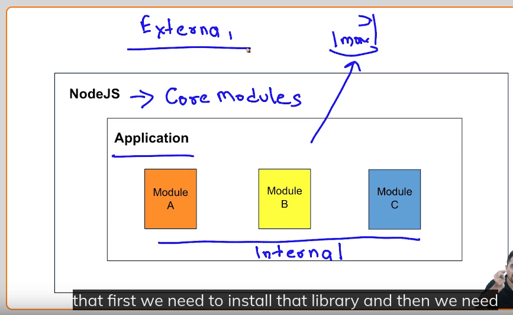
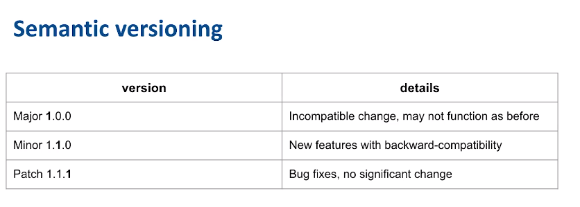
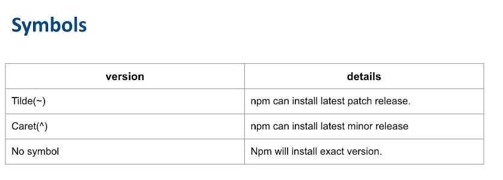

# Understanding Module

In Node.js, a module is a reusable and encapsulated piece of code that defines functionality and can be imported into other modules using the `require` statement.

- Suppose, i have one function in a file and i want to use it inside the another one. How can i do so, So, here modules comes in place.

- Generally working with js , many files gets compreseed into a single file and hence thre is not any problem, but thats not the case with Nodejs
- So, node js introduced modules.

1) We convert a file into an module. and later export it.
2) later import that module.

- **Two ways to create module**
    1) Common JS module (older version)
    2) ES6 module (newer version)

## CommonJs method

### Export

```js
function sum(x, y) {
  return x + y;
}

function div(x, y) {
  return x + y;
}

//Way-1
module.exports = { 
    add: sum,
    // div: div
};

//Way 2
// directly exported the file using
module.exports.sum = (x, y) => {
    return x+y;
}

//Way 3
exports.sum = (x, y) => {
    return x+y;
}
// Exports only return an property. It cant return an function, while module.exports works fine for everything whether it is a property or a function or a value
// That is this one will fail
exports = function(x, y){
    return x+y;
}


// Now the sum has became the property of the sum.exports object
```

### Import

```js
const arithmeticModule = require("./arithmetic")

let additionResult = arithmeticModule.add(5, 6);

//if i will try to access the div fn here, then i will get an error saying that div is not accessible.(More like that fiv is an private fn now)


```

- **require** do two things,
  - one it will execute the code
  - Second, it will cache the executed one, so that it has not to re-execute the file.

## ES6 Modules

To use ES6 exports and import methods, we have to rename our files as `arthimetic.mjs` and `result.mjs`. That is instead of using `js` at the end, we have to use `mjs`.

### Exports

```js
//way 1
export function sum(x, y) {
  return x + y;
}
//way 2
function div(x, y) {
  return x / y;
}

export {div};


//way 3
// Shorthand syntax of way 2
export const functionName = (x, y) => {
  return x + y;
};

```

### Imports

```js
// if i want to import a particular part
import { sum } from "./arithmetic";

//if i want to import everything from the file
//but this will only import those things, which we have exported from the file
import * as arthimeticModule from "./arithmetic"
```

- **Advantages of  ES6 syntaxes**
  - readability
  - optimization and performance
    - tree shaking , that  is it will remove those parts that are of no use to the application/never called.

### removing mjs extension

1) create package.json
2) add the following   `"type" : "module"`

# Types of Modules

1) `Internal / user defined modules`
    - modules created by us.

2) `Core Modules`
    - provided by nodejs
    - Example include `http` module

3) `External module`
    - Two types
        - **Run-time Dependencies** ==> These are dependencies that are required for the module to run correctly during execution.
        - **Build or development dependencies** ==> These are dependencies that are required during the development or build phase but are not needed at runtime.
        ==> installed using `npm i -D package_name` or `npm install --save-dev package-name`
    - The modules that are neither created by us, nor provided by Node.
    - They are basically a third party library
    - First we are required to install those packages using npm.
    - Example might include using some external module such as `mongoDB`


# Package Manager and npm

- Going to manage packages
- `Package` is a term which refers to third party modules

- **Roles**
  - Installation of packages
  - Version Management
  - Managing Dependencies
  - Publishing packages

## NPM

- The Default package manager for our node and every js application is Npm.
- by default ,we mean that it comes with nodejs
- Other package managers:
  - yarn

### Nodemon

- It is a simple monitor script for use during the development of a nodejs app

- It also restarts the server as soon as we make some changes inside the code.

### global installation of a package

`sudo npm i -g nodemon`

Location of installation ==>

```txt
/usr/local/lib/node_modules/nodemon
```

# Package.json

- Manages dependencies
  - manages names of the packages, their versions, their dependecies, and their veriosn and so on
  - manage scripts
    - We can create shorter commands like we used to do `npm start`
  - Details of Application
    - name, version, author, github url , license
    - **NOTE** EntryPoint is the point from where the code will start to execute

## Ways to make package.json

- Either manually
- or run
  - `npm init`
    - Will ask for all those details and finally create package.json for us.
  - Now, manually installl all those packages.

# Package-Lock.json

We can retrive node modules at any time by using `npm i`.

Suppose, someone after a year tries to clone my app. But by now, newer versions of modules are available, so npm will simply install the new one.

To prevent the above, package-lock.json was introduced
It will check ,and make sure that only those versions are installed which have been locked

- Auto-generated by npm
- Helps with the consistency of different machines
- prevents unwanted updates

# understanding version




# NVM

- Suppose, i am working on many applications simuntaneously. And one application uses node v.19, one used node v.10, and one uses the latest one.

- So, can we manage those verions on the local machine

- Answer is NVM ==> `node version manager`

## NVM installation on linux

```txt
sudo apt install curl 
curl https://raw.githubusercontent.com/creationix/nvm/master/install.sh | bash 
source ~/.bashrc  
```

- to get list of all the node versions installed on my machine by nvm
  - `nvm ls`

- to get list of all the available to download node versions installed on my machine by nvm
  - `nvm ls-remote`

- to install a particular verions do, say 19.8.1 :
  - `nvm install 19.8.1`  
  - will install
  - as well as set it as default node version

- to use a particular verion, say 18.15.0
  - `nvm use 18.15.0`
- to set a default version, use
  - `nvm alias default 19.8.1`

# Reading Command Line Input

- to read from terminal , nodejs has a seperate module i.e. `readline`

```js
//importing the readline
const readline = require('readline')

// 2. Building the connection b.w the aplication and the terminal
// Configuring interface to connect with terminal/command line

//the fn createInterface returns an interface which is stored inside the interface variable
const Interface = readline.createInterface({ 
    input : process.stdin, //process belongs to the nodejs ecosystem and it has property stdin which allows us to read inputs from the terminal
    output : process.stdout
})

// 3. read from termi
Interface.question("enter the first number", (num1)=>{
    //now i have recieved a number in num1
    //and have to ask for second number
    Interface.question("Enter the second number", (num2)=>{
        const sum = num1+num2;
        console.log(sum);
    })
    Interface.close()
}) // expects a string and a callback
```

# File System Module

- Suppose, we want to store/retrieve some data from file, there we require file system modules.

- So, we have an already built module for the file system, namely `fs` which stands for file system.

- Two ways to work with `fs` :
  1) Blocking code
  2) Non-blocking code

- File System is managed by operating system
- therefore, node.js is dependent on os.

## Reading a file using blocking code

- `readFileSync` is an sync operation, threfore it is going to be blocking one
- takes two options
    1) path ==> where my file is
    2) options ==> Which format/encoding we want

- fn will return us a buffer
- `buffer` is used when there is difference b/w sending and recieving speed. Say OS is sending 5chars/second, while we are able to recieve 3chars/second. Therefore, we are going to loose some important data, to prevent the same from happening, we require a temporary storage, namely buffer.

```js
const fs = require('fs');

//to read file content using blocking code.
console.log("Starting to read the file");


const buffer1 = fs.readFileSync("data.txt");
console.log(buffer1.toString()) //to_string was used to convert the buffer into string

const buffer2 = fs.readFileSync("data.txt", {encoding:"utf-8"});
console.log(buffer2) 

console.log("This is another operation which is being performed");


```

## Writing/Creating/Deleting/Appending a file

- `writeFileSync`
  - Used to create files
  - takes two parameters
    - Name of the file
    - Content which we want to write in that file

  - If there already exists a file, then good
  - else , it will create a file for me

  - If the operation gets successful , return void. else throws an error ==> therfore, wrap inside try/catch block
- `appendFileSync`
  - Append in an original file
- `unlinkSync`
  - To delete a file.

```js
const fs = require("fs");

//Creating a file
try {
  fs.writeFileSync(
    "employee.txt",
    "Name : John Doe, Age : 40, position : Manager"
  );
} catch (err) {
  console.error(err);
}

//To append some data to an existing file
fs.appendFileSync("employee.txt", "Name : David , age : 55, Position: CEO");

// To delete a file
// Node js is not able to delete a file
// it will just unlink the file from os, and hence it will gte deleted
try {
  fs.unlinkSync("employee.txt");
} catch (err) {
  console.log("File don't exist", err);
}

console.log("This is another operation which is being performed");

```
