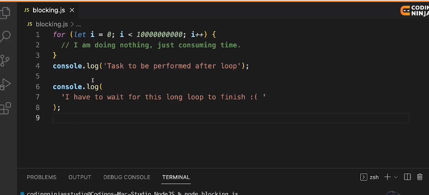
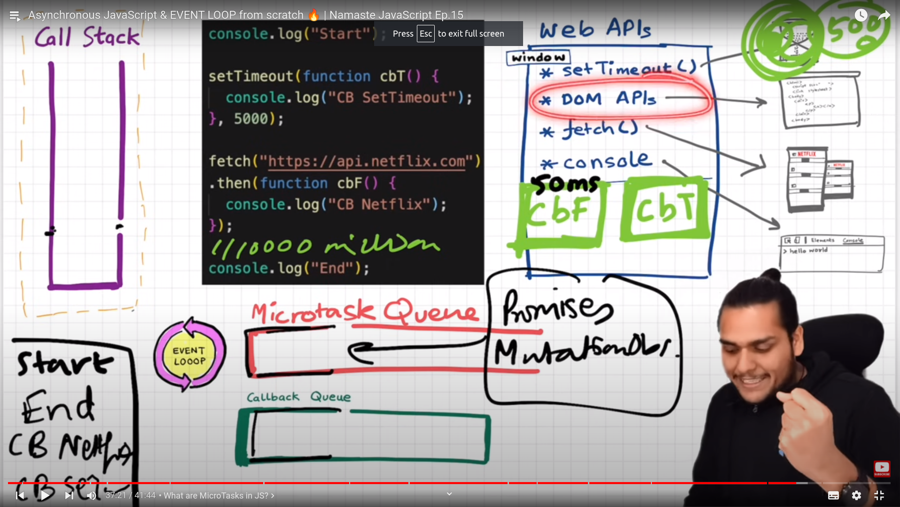
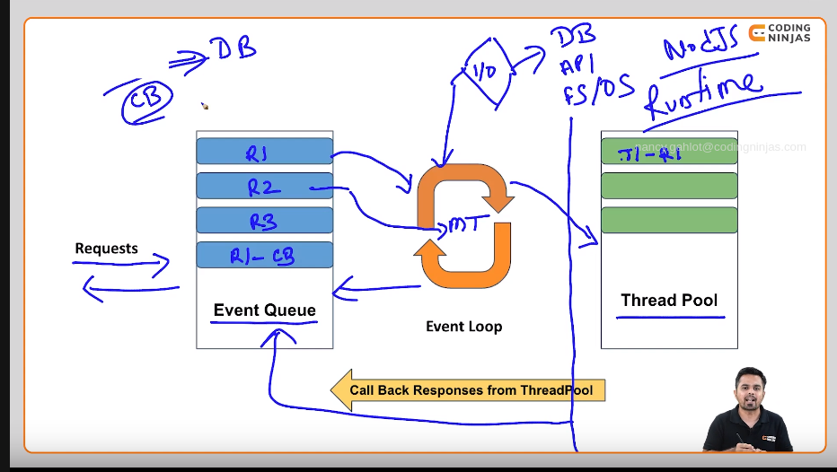
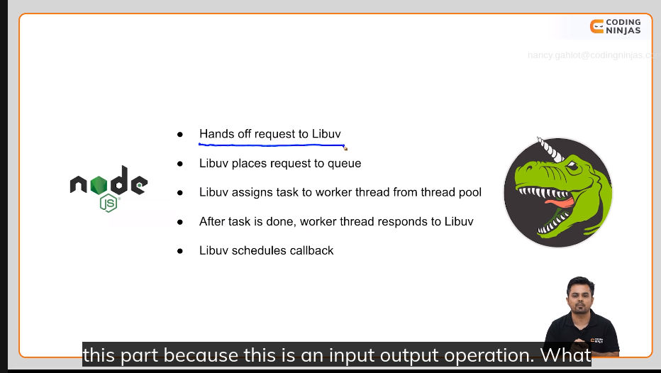
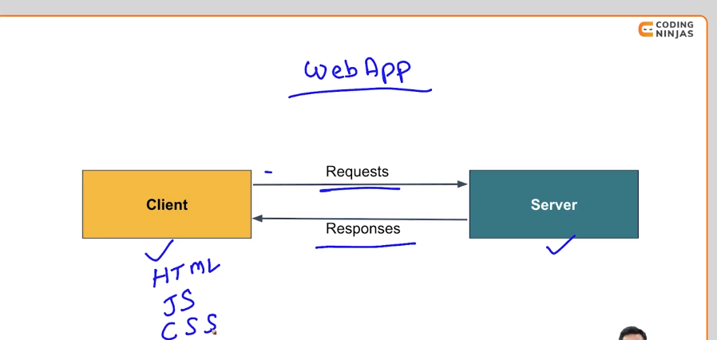

# Intro to Nodejs

## What is Nodejs

An open-source, cross-platform server-side runtime for js

## Why Nodejs?

- why to use nodejs when we have .net, php.
- Answer :
  - handles async opertaions betterly
  - Faster than exisiting tools.

## How nodeJs was created?

- Using c++
- Using V8 engine of Chrome which is fastest of all
- wrapped inside js so that this c++ engine can run js.

# Why Nodejs is popular?


- High Performance due to
  - event driven Non blocking IO
  - That  is it can handle multiple requests together.

- Role of JS:
  - A js developer will always prefer a js runtime env than a python/php one.

- Light Weight
  - doesnt require a lot of memory and space.

- Works very well with data-driven applications

# Runtimes

Runtime is like an enviornment for an programming language which helps their programs to run.

## Roles of an Run-time

- Compiles/interprets
- Memory Management
- Handles inputs/output operations
- Garbage collection.

- **Server Side Runtime for js** ==> nodeJS
- **Client Side Runtime for js** ==> Chrome ==> V8 Engine.


# Blocking and Non-blocking Code



In the above code, my single thread of js is busy in running the above loop. and can't print the messages.
This is how the blocking of the code work.

- **problem** ==> Imagine , entire facebook app runnning on a single thread and that one single thread is got blocked by some code.

Non-Blocking code example

```js
// Non-Blocking code example

setTimeOut(()=>{
  console.log("Task to be performed after 8 seconds");
}, 8000)
console.log("Now, i do not have to wait for the above fn to finish")
```

But what makes it possible for a single threaded application to write up a non-blocking code.

**Thing to remember** ==>`CallStack-empty ==> Microtask queue`(Checks for promises and mutations in the dom) `==> Callback queue`


# How Node.js Works?

- `Event queue` has all the requests aligned in it.
- `Main thread` Single thread of js. checks if an request requires an I/O operation or is async.
  - If yes ==> then take a thread from the thread pool.
  - else ==> I will do it.
- When the thread complete , it will be added back to the event queue.

- `Thread pool` is built and maintained by runtimes/engines.

- This makes js faster than python and java as it is not the responsibility of js to built and check for those threads. They are maintained by the runtime.
But has one cons:
  - **PROBLEM** Nodejs only builds threads for the i/o operations , but what about a for loop which runs for 1,000,000,000 times?

# Understanding Libuv

How nodejs mamages thread pool , worker threads and how exactly it amanges async calls whiel being cross-platform run-time too.

- It uses Libuv
- A cross platform library which focuses on async I/O.
- Written in C
- Used by Nodejs, Luvit, Julia
- Provides abstraction over OS
- Manages worker threas and event loops.

## Process inside Libuv



# What is a server?



- **Roles of Server**:
  - Handling requests from Client
  - Sending Responses to the client
  - Authentication
  - Database access
  - file system access

# Creating an HTTP server

 HTTP ==> HyperText Transfer Protocol

- Lays rules which Clients and servers require to follow.

- Can Contain
  - Type of request
  - type of content
  - Status code from the server
  -

```js
//Creating a server using NodeJS

// 1. import http library/module
//require is basically a fn where we are required to specify what we want.
//It will returm me that module
const http = require("http");

//2. Create an server
// http.createServer(requestListener)
//requestListener takes two parameters => request and response
const server = http.createServer((req, resp) => {
  //here comes the request.

  //end basically ends the lifecycle of the server
  resp.end("Welcome to Nodejs Server");
});
// from the above code , how will my client know, if he is connected to the correct server.
//because it might be that my machine has a running of more than 100 servers.
//that is where the port comes

//3. Specify the port
//make sure to use only that port number that is not in use.
server.listen(3100, () => {
  // 4. now , i want a confirmation that my code run
  console.log("server is listening on port 3100");
});

```

# handling multiple requests

Suppose i want to now handle the requests for the localhost:3100/user or localhost:3100/profile.
For it , we can use `req.url`

```js
const server = http.createServer((req, resp) => {
    
    if(req.url == "/profile"){
        resp.end("This is teh profile page");
        return;
    }else if(req.url == "/user"){
        resp.end("This is teh user page")
        return
    }else if(req.url == "/product"){
        resp.end("This is teh product page")
        return

    }else{
        resp.end("This is the default page")
        return
    }
});
```

**remember** ==> Not to send anything/modify the reponse after the end as the connection has now ended, and this might cause issues in the code.
**NOTE** use the return keyword only when we have done our work , else we might not be able to do some important fns such as logging/anything as such.

```js
//req.write acts like an string concatenator. adds two reponses/messges together.
res.write("welcome to my experiment page")
```

# returning HTML as an Response

Suppose i want to send an HTML file from my server.
The files name is `index.html`.

```js
const http = require('http');
const fs = require('fs')
const server = http.createServer((req, Response)=>{
    //first we need to read the html file inside js
    //so we will use an module namely fs module(file-system module)

    const htmlFileData = fs.readFileSync("/home/aryan/Desktop/Projects/Web-dev/CodingNinjas-Nodejs/Week 1/index.html");
    const htmlDataInFormOfString  = htmlFileData.toString();
    Response.end(htmlDataInFormOfString)
})

server.listen(3100, ()=>{console.log("serber is listening")})
```

 But the above code will work only for the static page.
